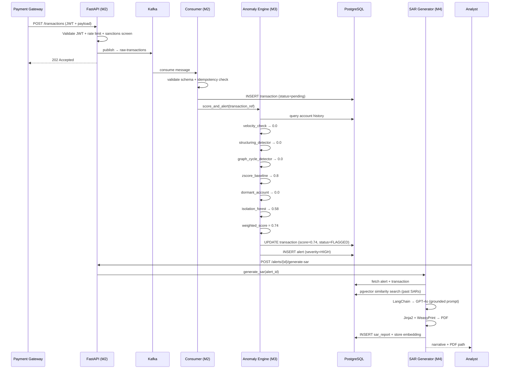

# FinSight Compliance Engine — Architecture

## System Overview

FinSight is a real-time AML compliance platform for Indian fintech, designed to process transaction events at Razorpay/Zerodha-scale workloads. It replaces manual compliance review (4–6 hours per case) with automated detection and AI-drafted SARs (15-minute analyst review).

---

## High-Level Architecture

```
┌─────────────────────────────────────────────────────────────────────┐
│                         FINSIGHT PLATFORM                           │
│                                                                     │
│  ┌──────────┐   POST /api/v1/transactions   ┌───────────────────┐  │
│  │ Payment  │ ────────────────────────────► │   FastAPI         │  │
│  │ Gateway  │                               │   (Module 2)      │  │
│  └──────────┘                               │   - JWT Auth      │  │
│                                             │   - Rate Limiting │  │
│                                             │   - Sanctions     │  │
│                                             └────────┬──────────┘  │
│                                                      │ publish     │
│                                                      ▼             │
│                                             ┌───────────────────┐  │
│                                             │   Kafka           │  │
│                                             │   raw-transactions│  │
│                                             │   compliance-alerts│  │
│                                             │   dlq-transactions│  │
│                                             └────────┬──────────┘  │
│                                                      │ consume     │
│                                                      ▼             │
│                                             ┌───────────────────┐  │
│                                             │  Anomaly Engine   │  │
│                                             │  (Module 3)       │  │
│                                             │  - Velocity Check │  │
│                                             │  - Structuring    │  │
│                                             │  - Graph Cycles   │  │
│                                             │  - Z-Score        │  │
│                                             │  - Dormant Acct   │  │
│                                             │  - Isolation Forest│  │
│                                             └────────┬──────────┘  │
│                                                      │ score ≥ 0.6 │
│                                                      ▼             │
│                                             ┌───────────────────┐  │
│  ┌──────────────┐  POST generate-sar        │  Alert Created    │  │
│  │  Compliance  │ ─────────────────────────►│  PostgreSQL       │  │
│  │  Analyst     │                           └────────┬──────────┘  │
│  └──────────────┘                                    │             │
│         ▲                                            ▼             │
│         │ PDF download                    ┌───────────────────┐    │
│         │                                 │  SAR Generator    │    │
│         └─────────────────────────────────│  (Module 4)       │    │
│                                           │  - pgvector search │    │
│                                           │  - LangChain chain │    │
│                                           │  - GPT-4o/mini     │    │
│                                           │  - WeasyPrint PDF  │    │
│                                           └───────────────────┘    │
└─────────────────────────────────────────────────────────────────────┘
```

---

## Transaction Lifecycle — Sequence Diagram



---

## Module Breakdown

| Module | Purpose | Key Files |
|--------|---------|-----------|
| M1 | Infrastructure skeleton | `docker-compose.yml`, `models.py`, `session.py`, `main.py` |
| M2 | Kafka ingestion layer | `kafka/schemas.py`, `producer.py`, `consumer.py`, `dlq.py` |
| M3 | Anomaly detection engine | `flink/operators/aggregator.py` + 5 operator files + `models/isolation_forest.pkl` |
| M4 | SAR generation | `compliance/sar_generator.py`, `embeddings.py`, `pdf_renderer.py` |
| M5 | Auth, RBAC, security | `core/security.py`, `dependencies.py`, `rate_limiter.py`, `compliance/sanctions.py` |
| M6 | Observability + CI/CD | `core/metrics.py`, `monitoring/`, `.github/workflows/ci.yml` |

---

## Tech Stack

| Layer | Technology | Purpose |
|-------|-----------|---------|
| API | FastAPI + Pydantic v2 | REST API, request validation, OpenAPI docs |
| Event Streaming | Apache Kafka (Confluent) | Real-time transaction ingestion |
| Database | PostgreSQL 15 + pgvector | Persistent storage + vector similarity search |
| Cache / Rate Limit | Redis 7 | Sliding window rate limiting |
| Anomaly Detection | scikit-learn (Isolation Forest) | ML-based multi-feature anomaly scoring |
| Graph Analysis | NetworkX | Round-trip money cycle detection |
| AI / LLM | LangChain + GPT-4o | SAR narrative generation (grounded in DB data) |
| PDF Generation | WeasyPrint + Jinja2 | FIU-IND compliant SAR documents |
| Entity Screening | rapidfuzz | Fuzzy sanctions/PEP list matching |
| Auth | JWT (python-jose) + bcrypt | Stateless authentication + password hashing |
| Observability | Prometheus + Grafana | Metrics, dashboards, alerting |
| CI/CD | GitHub Actions | Lint → test → Docker build on every push |
| IaC | Docker Compose | Full local stack in one command |

---

## Database Schema

```
tenants ──< users
tenants ──< transactions ──< alerts ──< sar_reports
tenants ──< audit_log
```

Key design choices:
- **UUID primary keys** — globally unique across tenants, no collision risk
- **`amount` as `Numeric(18,2)`** — exact decimal storage, no float rounding errors
- **`metadata_json` as `JSONB`** — indexable, queryable structured metadata
- **`narrative_embedding` as `Vector(1536)`** — pgvector for semantic similarity search
- **Append-only `audit_log`** — no UPDATE/DELETE permissions at DB level

---

## Security Model

```
Role            Can Do
─────────────────────────────────────────────────
admin           Full access + user management
risk_manager    View + generate SARs + approve alerts
compliance_analyst  Submit transactions + generate SARs
auditor         Read-only access to all records
```

Every query is filtered by `tenant_id = current_user.tenant_id`. Cross-tenant data access is impossible at the ORM layer.

---

## Quick Start

```bash
# Clone and start
git clone https://github.com/pranav4156/FinSight-Compliance-Engine
cd FinSight-Compliance-Engine

# Start all infrastructure
docker compose up -d

# Set up database and seed admin user
poetry install
poetry run alembic upgrade head
python scripts/seed_admin.py

# Train the ML model
python scripts/train_model.py

# Start the API
poetry run uvicorn app.main:app --reload

# Run the end-to-end demo
python scripts/demo.py
```

**Credentials:** `admin@finsight.dev` / `Admin@123`

**URLs:**
- API docs: http://localhost:8000/docs
- Kafka UI: http://localhost:8080
- Grafana: http://localhost:3000 (admin / finsight123)
- Prometheus: http://localhost:9090
